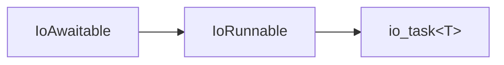
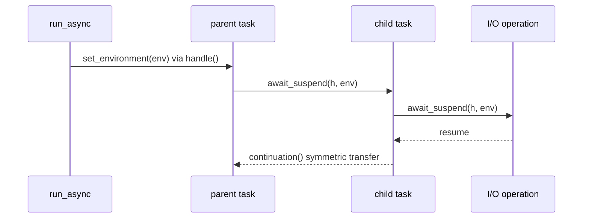

## Abstract

This paper asks: *what would an execution model look like if designed from the ground up for coroutine-only asynchronous I/O?*

We built one and found out. A group of practitioners implemented a complete networking library using only coroutines - no callbacks, no sender/receiver chains, no completion tokens. The result is the _IoAwaitable_ protocol: a system for associating a coroutine with an executor, stop token, and allocator, and propagating this context forward through a coroutine chain to the operating system API boundary where asynchronous operations are performed.

This paper presents our findings. The protocol is small: two concepts, a type-erased executor, and a thread-local allocation window. It delivers correctness through compile-time protocol checking, ergonomics through clean interfaces free of cross-cutting concerns, and performance through zero-allocation steady-state operation with recycling allocators. We compare our design against `std::execution` ([P2300](https://wg21.link/p2300)) and its evolution ([P3826](https://wg21.link/p3826)) to illuminate where the designs diverge and why.

---

## 1. Introduction

This paper is a research report. We set out to answer a practical question: if you design a networking library from the ground up for C++ coroutines, what execution model emerges? Not as a thought experiment, but as working code - a complete library with sockets, timers, TLS, DNS resolution, HTTP, and WebSocket support, all built on a coroutine-only foundation.

The answer surprised us in its simplicity. Two operations for resuming coroutines suffice: `dispatch` for continuations and `post` for independent work. Three pieces of context propagate forward through coroutine chains: an executor, a stop token, and an allocator. The result is a small protocol that we believe is worth sharing with the committee, regardless of where it leads.

### Design Priorities

We adopted three priorities, in strict order:

1. **Correctness.** The protocol must make incorrect usage a compile error wherever possible. If a coroutine does not participate in the protocol, co_awaiting it should fail to compile. If context is missing, the error should be caught statically, not at runtime.

2. **Ergonomics.** Coroutine signatures should describe the algorithm's interface, not its execution machinery. A function that reads HTTP headers should not need to know or care about allocator policy. Cross-cutting concerns like allocation and cancellation belong at the launch site, not threaded through every function signature.

3. **Performance.** With correctness and ergonomics established, the protocol must deliver competitive throughput. Zero-allocation steady-state operation through recycling allocators, symmetric transfer for minimal dispatch latency, and type erasure that piggybacks on the coroutine frame rather than adding overhead.

### What Networking Needs

Studying I/O-intensive applications reveals clear patterns. A network server completes read operations on I/O threads, resumes handlers on application threads, and serializes access to connection state. A file system service batches completions through io_uring, dispatches callbacks to worker pools, and manages buffer lifetimes across suspension points. These patterns repeat across every I/O application. The requirements they impose are specific:

- **The application decides executor policy.** Thread affinity, strand serialization, priority scheduling - these are deployment decisions. A read operation doesn't care which thread pool it runs on. The application architecture determines where completions should resume.

- **The application sends stop signals.** Cancellation flows downward from application logic, not upward from I/O operations. A timeout, user abort, or graceful shutdown originates at the application layer and propagates to pending operations. The socket doesn't decide when to cancel itself.

- **The application decides allocation policy.** Memory strategies - recycling pools, bounded allocation, per-tenant budgets - these are a property of the coroutine chain, not the I/O operation. A socket doesn't care about memory policy; the context in which it runs does.

- **The execution context owns its I/O objects.** A socket registered with epoll on thread A cannot have completions delivered to thread B's epoll. The physical coupling is inherent. The call site cannot know which event loop the socket uses - only the socket knows.

Execution context flows naturally *forward* through async operation chains. The executor, stop token, and allocator propagate from caller to callee at each suspension point. Context is known at the launch site, not discovered through queries after the work graph is built.

---

## 2. Understanding Asynchronous I/O

Not every committee member or library reviewer works with network programming daily, and the challenges that shape I/O library design may not be immediately obvious from other domains. This section provides the background needed to evaluate the design decisions that follow. The concepts presented here draw heavily from Christopher Kohlhoff's pioneering work on Boost.Asio, which has served the C++ community for over two decades, and from Gor Nishanov's C++ coroutines that now enable elegant expression of asynchronous control flow. Readers already familiar with event loops, completion handlers, and executor models may skip ahead to §3.

### 2.1 The Problem with Waiting

Network I/O operates on a fundamentally different timescale than computation. A CPU executes billions of instructions per second; reading a single byte from a local network takes microseconds, and from a remote server, milliseconds. The disparity is stark:

| Operation | Approximate Time |
|-----------|------------------|
| CPU instruction | 0.3 ns |
| L1 cache access | 1 ns |
| Main memory access | 100 ns |
| Local network round-trip | 500 μs |
| Internet round-trip | 50-200 ms |

When code calls a blocking read on a socket, the thread waits—doing nothing—while the network delivers data. During a 100ms network round-trip, a modern CPU could have executed 300 billion instructions. Blocking I/O wastes this potential.

```cpp
// Blocking I/O: thread waits here
char buf[1024];
ssize_t n = recv(fd, buf, sizeof(buf), 0);  // Thread blocked
process(buf, n);
```

For a single connection, this inefficiency is tolerable. For a server handling thousands of connections, it becomes catastrophic.

### 2.2 The Thread-Per-Connection Trap

The natural response to blocking I/O is to spawn a thread per connection. Each thread blocks on its own socket; while one waits, others make progress.

```cpp
void handle_client(socket client) {
    char buf[1024];
    while (auto [ec, n] = client.read_some(buf); !ec) {
        process(buf, n);
    }
}

// Spawn a thread for each connection
for (;;) {
    socket client = accept(listener);
    std::thread(handle_client, std::move(client)).detach();
}
```

This works—until it doesn't. Each thread consumes memory (typically 1MB for the stack) and creates scheduling overhead. Context switches between threads cost thousands of CPU cycles. At 10,000 connections, you have 10,000 threads consuming 10GB of stack space, and the scheduler spends more time switching between threads than running actual code.

The [C10K problem](http://www.kegel.com/c10k.html)—handling 10,000 concurrent connections—revealed that thread-per-connection doesn't scale. Modern servers handle millions of connections. Something else is needed.

### 2.3 Event-Driven I/O

The solution is to invert the relationship between threads and I/O operations. Instead of one thread per connection, use a small number of threads that multiplex across many connections. The operating system provides mechanisms to wait for *any* of a set of file descriptors to become ready:

- **Linux**: `epoll` — register interest in file descriptors, wait for events
- **Windows**: I/O Completion Ports (IOCP) — queue-based completion notification
- **BSD/macOS**: `kqueue` — unified event notification

These mechanisms enable the **proactor pattern**: instead of blocking until an operation completes, you *initiate* an operation and receive notification when it finishes. The thread is free to do other work in the meantime.

```cpp
io_context ioc;
socket sock(ioc);
sock.open();

// Initiate an async operation - returns immediately
auto [ec] = co_await sock.connect(endpoint(ipv4_address::loopback(), 8080));
// Execution resumes here when the connection completes
```

The `io_context` is the heart of this model. It maintains a queue of pending operations and dispatches completions as they arrive from the OS. Calling `ioc.run()` processes this queue:

```cpp
io_context ioc;
// ... set up async operations ...
ioc.run();  // Process completions until no work remains
```

A single thread calling `run()` can service thousands of connections. For CPU-bound workloads, multiple threads can call `run()` on the same context, processing completions in parallel.

### 2.4 Completion Handlers and Coroutines

Early asynchronous APIs used callbacks to handle completions:

```cpp
// Callback-based async (traditional style)
socket.async_read(buffer, [](error_code ec, size_t n) {
    if (!ec) {
        // Process data, then start another read...
        socket.async_read(buffer, [](error_code ec, size_t n) {
            // More nesting...
        });
    }
});
```

This "callback hell" inverts control flow, making code hard to follow and debug. Error handling becomes scattered across nested lambdas. State must be explicitly captured and managed.

C++20 coroutines restore sequential control flow while preserving the efficiency of asynchronous execution:

```cpp
// Coroutine-based async (modern style)
task<> handle_connection(socket sock) {
    char buf[1024];
    for (;;) {
        auto [ec, n] = co_await sock.read_some(buf);
        if (ec)
            co_return;
        co_await process_data(buf, n);
    }
}
```

The `co_await` keyword suspends the coroutine until the operation completes, then resumes execution at that point. The code reads sequentially, but executes asynchronously. The `task<>` return type represents a coroutine that can be awaited by a caller or launched independently.

### 2.5 The Execution Context

I/O objects must be associated with an execution context that manages their lifecycle and delivers completions. A `socket` created with an `io_context` is registered with that context's platform reactor (epoll, IOCP, etc.). This binding is physical—the socket's file descriptor is registered with specific kernel structures.

```cpp
io_context ioc;
socket sock(ioc);  // Socket bound to this context
sock.open();

// The socket's completions will be delivered through ioc
auto [ec] = co_await sock.connect(endpoint);
```

This binding has implications:
- A socket cannot migrate between contexts
- Completions are delivered to the context that owns the socket
- The context must remain alive while operations are pending

The `io_context` abstracts platform differences. On Windows, it wraps an I/O Completion Port. On Linux, it wraps epoll (or io_uring). Application code remains portable while the implementation leverages platform-specific optimizations.

### 2.6 Executors

An **executor** determines where and how work runs. It answers: when an async operation completes, which thread should run the completion handler? Should it run immediately, or be queued for later?

```cpp
auto ex = ioc.get_executor();
```

The executor provides two fundamental operations:

**`dispatch`** — Run work immediately if safe, otherwise queue it. When the I/O context thread detects a completion, it typically dispatches the waiting coroutine inline for minimal latency.

**`post`** — Always queue work for later execution. Use this when you need a guarantee that the work won't run until after the current function returns—for example, when holding a lock.

```cpp
// Dispatch: may run inline
ex.dispatch(continuation);

// Post: always queued
ex.post(new_work);
```

The distinction matters for correctness. Dispatching while holding a mutex could cause the completion handler to run immediately, potentially deadlocking if it tries to acquire the same mutex. Posting guarantees the handler runs later, after the lock is released.

### 2.7 Strands: Serialization Without Locks

When multiple threads call `ioc.run()`, completions may execute concurrently. If two coroutines access shared state, you need synchronization. Mutexes work but introduce blocking—the very thing async I/O tries to avoid.

A **strand** provides an alternative: it guarantees that handlers submitted through it never execute concurrently, without using locks.

```cpp
strand my_strand(ioc.get_executor());

// Entire coroutine runs serialized through the strand
run_async(my_strand)(handle_connection(sock));
```

Handlers on a strand execute in FIFO order, one at a time. Multiple strands can make progress concurrently on different threads, but within a single strand, execution is sequential. This enables safe concurrent access to connection state without explicit locking.

### 2.8 Cancellation

Long-running operations need a way to stop gracefully. A connection might timeout. A user might close a window. A server might be shutting down.

C++20's `std::stop_token` provides cooperative cancellation:

```cpp
std::stop_source source;
std::stop_token token = source.get_token();

// Launch a coroutine with a stop token
run_async(ex, token)(long_running_operation());

// Later, request cancellation
source.request_stop();
```

The stop token propagates through the coroutine chain. At the lowest level, I/O objects observe the token and cancel pending operations with the appropriate OS primitive (`CancelIoEx` on Windows, `IORING_OP_ASYNC_CANCEL` on Linux). The operation completes with an error, and the coroutine can handle it normally.

Cancellation is cooperative—no operation is forcibly terminated. The I/O layer requests cancellation, the OS acknowledges it, and the operation completes with an error code. This keeps resource cleanup predictable and avoids the hazards of abrupt termination.

### 2.9 Moving Forward

With these fundamentals in hand—event loops, executors, strands, and cancellation—you have the conceptual vocabulary to understand the design decisions in the sections that follow. These patterns form the bedrock of modern C++ networking: every high-performance server, every responsive client application, builds on some combination of non-blocking I/O, completion handlers, and execution contexts.

If you're eager to experiment, the [Corosio](https://github.com/cppalliance/corosio) library implements these concepts in production-ready code. It provides sockets, timers, TLS, and DNS resolution—all built on the coroutine-first model we'll explore in depth. The [Boost.Asio](https://www.boost.org/doc/libs/release/doc/html/boost_asio.html) documentation and its many community tutorials offer additional paths to hands-on learning. Building a simple echo server or chat application is one of the best ways to internalize how these pieces fit together.

The rest of this paper examines what an execution model looks like when these networking requirements drive the design from the ground up.

---

## 3. What Networking Needs

Networking has specific requirements that differ from parallel computation. A socket read has **one implementation per platform**—there's no algorithm selection, no hardware heterogeneity to manage. There are other important concerns:

- **Platform implementation**: Integration with IOCP, epoll, io_uring
- **Strand serialization**: Ordering guarantees for concurrent access
- **Thread affinity**: Handlers must resume on the correct thread
- **Inline vs queued**: Choosing whether continuations run immediately or are deferred
- **Stack depth control**: Bounding recursion through trampolining or deferred dispatch

Strip these requirements down to their essence. What primitive do they all depend on? **Something that runs work**. An _executor_. Completion contexts, strands, and thread affinity are all built on executors. I/O objects must be bound to an executor's context to work correctly. [P2762](https://wg21.link/p2762) acknowledges this reality in §4.1:

> "It was pointed out networking objects like sockets are specific to a context: that is necessary when using I/O Completion Ports or a TLS library and yields advantages when using, e.g., io_uring(2)."

### 3.1 The Executor

An executor is to functions what an allocator is to memory: while an allocator controls *where* objects live, an executor controls *how* functions run. Examining decades of asynchronous I/O patterns reveals that a minimal executor needs only two operations. The first operation handles work that continues the current operation—a completion handler that should run as part of the same logical flow. The second handles work that must begin independently—a task that cannot start until after the initiating call returns. These two cases have distinct correctness requirements, captured by `dispatch` and `post`.

#### `dispatch`

When an I/O operation completes at the operating system level, the suspended coroutine must resume. The kernel has signaled that data is ready or a connection is established; now user code must process the result. In this context, resuming the coroutine immediately, on the current thread and without queuing, is both safe and efficient. No locks are held by the I/O layer. The completion is a natural continuation of the event loop's work.

This pattern is captured by `dispatch`. It resumes the provided coroutine immediately if doing so is safe within the executor's rules, or queues it otherwise. For a strand, "safe" means no other coroutine is currently executing on that strand. For a thread pool, it might mean the caller is already on a pool thread. The executor decides; the caller simply requests execution.

This is the common case for I/O completions. The event loop calls `dispatch` with the coroutine, and in the typical case the coroutine resumes inline without touching any queue. The result is minimal latency and zero allocation for the dispatch itself.

#### `post`

Sometimes inline execution is not just inefficient but incorrect. Consider code that initiates an async operation while holding a mutex, expecting the lock to be released before the completion runs. Or a destructor that launches cleanup work and must return before that work begins. These patterns require a guarantee: the coroutine will not execute before the call returns.

The `post` operation provides this guarantee. It always queues coroutines for later execution, never running inline. The caller can rely on control returning before the coroutine begins. This makes `post` suitable for breaking call chains, avoiding reentrancy, and ensuring ordering when the caller's state must settle before continuation.

The cost is queue insertion and eventual dequeue—cycles that `dispatch` avoids when inline execution is safe. But when correctness requires deferred execution, `post` is the only sound choice.

### 3.2 The `stop_token`

C++20 introduced `std::stop_token` as a cooperative cancellation mechanism. A `stop_source` owns the cancellation state; the token provides a read-only view that can be queried or used to register callbacks. When `stop_source::request_stop()` is called, all associated tokens observe the cancellation and registered callbacks fire.

Cancellation flows downward. The application—not the I/O operation—decides when to stop. A timeout, user abort, or graceful shutdown originates at the application layer and propagates to pending operations. The socket doesn't decide when to cancel itself; it receives a stop request from above.

In our model, the stop token is injected at the coroutine launch site and propagated through the entire chain. Consider:

```
http_client → http_request → write → write_some → socket
```

The top-level caller provides a `stop_token`. Each coroutine in the chain receives it and passes it forward. At the end of the chain, the I/O object—the socket—receives the token and can act on it.

This is where the operating system enters. Modern platforms provide cancellation at the kernel level:

- **Windows IOCP**: `CancelIoEx` cancels pending overlapped operations on a specific handle
- **Linux io_uring**: `IORING_OP_ASYNC_CANCEL` cancels a previously submitted operation by its user data
- **POSIX**: `close()` on the file descriptor, though less graceful, interrupts blocking operations

When the stop token signals cancellation, the I/O object registers a callback that invokes the appropriate OS primitive. The pending operation completes with an error—typically `operation_aborted`—and the coroutine chain unwinds normally through its error path.

This design keeps cancellation cooperative and predictable. No operation is forcibly terminated mid-flight. The I/O layer requests cancellation; the OS acknowledges it; the operation completes with an error; the coroutine handles the error. Each layer respects the boundaries of the next.

### 3.3 The Allocator

Neither callbacks nor coroutines achieve competitive performance without allocation control. Early testing showed that fully type-erased callbacks—using `std::function` at every composition boundary—allocated hundreds of times per invocation and ran an order of magnitude slower than native templates. Non-recycling coroutine configurations perform so poorly, dominated by heap allocation overhead, that they are not worth benchmarking.

**Recycling is mandatory for performance.** Thread-local recycling—caching recently freed memory for immediate reuse—enables zero steady-state allocations. Callbacks achieve this through "delete before dispatch": deallocate operation state before invoking the completion handler. Coroutines achieve it through frame pooling: custom `operator new/delete` recycles frames across operations.

But thread-local recycling optimizes for throughput, not all applications. Different deployments have different needs:

- **Memory conservation**: Embedded systems or resource-constrained environments may prefer bounded pools over unbounded caches
- **Per-tenant limits**: Multi-tenant servers need allocation budgets per client to prevent resource exhaustion
- **Debugging and profiling**: Development builds may want allocation tracking that production builds eliminate

Coroutines are continuously created—every `co_await` may spawn new frames. An execution model must make allocation a first-class customization point that controls *all* coroutine allocations, not just selected operations. Without this, memory policy becomes impossible to enforce.

**The allocator must be present at invocation.** Coroutine frame allocation has a fundamental timing constraint: `operator new` executes before the coroutine body. When a coroutine is called, the compiler allocates the frame first, then begins execution. Any mechanism that injects context later—receiver connection, `await_transform`, explicit method calls—arrives too late.

[P2762](https://wg21.link/p2762) acknowledges that the receiver-based model brings scheduler and operation together "rather late"—at `connect()` time, after the work graph is already built:

> "When the scheduler is injected through the receiver the operation and used scheduler are brought together rather late, i.e., when `connect(sender, receiver)`ing and when the work graph is already built."

For coroutines, this timing is fundamentally incompatible with frame allocation. The allocator must be discoverable from the coroutine's launch site before the coroutine frame is created.

> **Non-normative note.** Performance measurements comparing recycling allocators against default allocation in coroutine-intensive workloads are forthcoming in a future revision. Our implementation experience indicates that the difference is substantial enough to make allocator customization a requirement rather than an optimization.

---

## 4. Our Solution: The _IoAwaitable_ Protocol

The _IoAwaitable_ protocol is a pair of concepts layered on top of each other, working together to deliver what coroutines and networking need for correctness and performance:



To help readers understand how these requirements fit together, this paper provides the `io_awaitable_support` CRTP mixin (§9.1) as a non-normative reference implementation. It is not proposed for standardization - implementors may write their own machinery - but examining it clarifies how the protocol works in practice. The mixin also provides the `this_coro::environment` accessor, which allows coroutines to retrieve their bound context without suspending.

### 4.1 IoAwaitable

The _IoAwaitable_ concept allows a coroutine to receive **context**: the three things a coroutine needs for I/O—the executor, the stop token, and the allocator. Context propagates **forward** from caller to callee using a well-defined, easy to understand protocol. Most importantly, this protocol _does not require templates_ in the definition of its coroutine machinery. Because the protocol uses type-erased wrappers like `executor_ref` rather than template parameters, context types do not leak into the awaitable's type signature—`task<T>` remains simply `task<T>`, not `task<T, Environment>`.

```cpp
struct io_env
{
    executor_ref executor;
    std::stop_token stop_token;
    std::pmr::memory_resource* allocator = nullptr;
};

template< typename A >
concept IoAwaitable =
    requires(
        A a, std::coroutine_handle<> h, io_env const* env )
    {
        a.await_suspend( h, env );
    };
```

The key insight: `await_suspend` receives the execution environment as a parameter, injected by the caller's `await_transform`. The allocator is part of the environment—available to any awaitable in the chain. For coroutine frame allocation specifically, the allocator also propagates via `thread_local` storage during a narrow execution window with specific guarantees, ensuring availability at frame allocation time (more on this later).

#### Satisfying IoAwaitable

The _IoAwaitable_ concept is the foundation of the protocol. Any type that can be `co_await`ed and participates in context propagation must satisfy this concept.

**Requirements:**

1. Implement `await_suspend(std::coroutine_handle<> cont, io_env const* env)`
2. Store the environment by pointer (never by copy); the pointed-to `io_env` is guaranteed to outlive the coroutine
3. Return a `std::coroutine_handle<>` for symmetric transfer (or `void`/`bool` per standard rules)
4. Implement `await_ready()` and `await_resume()` per standard awaitable requirements

**Example implementation:**

```cpp
template< typename T >
struct my_awaitable
{
    io_env const* env_ = nullptr;
    std::coroutine_handle<> cont_;
    T result_;

    bool await_ready() const noexcept { return false; }

    // This signature satisfies IoAwaitable
    std::coroutine_handle<> await_suspend( std::coroutine_handle<> cont, io_env const* env )
    {
        cont_ = cont;
        env_ = env;
        start_async_operation();
        return std::noop_coroutine();
    }

    T await_resume() { return result_; }
};
```

#### Compile-Time Protocol Checking

The two-argument `await_suspend` signature is not just an implementation detail - it is a deliberate design choice for correctness. When a compliant coroutine's `await_transform` calls the two-argument `await_suspend`, a non-compliant awaitable (lacking this signature) produces a compile error. Similarly, a compliant awaitable awaited from a non-compliant coroutine fails to compile. Both sides of every suspension point are statically verified:

```cpp
template<typename A>
auto await_transform(A&& a) {
    static_assert(IoAwaitable<A>,
        "Awaitable does not satisfy IoAwaitable; "
        "await_suspend(std::coroutine_handle<>, io_env const*) is required");
    // Return wrapper that forwards to: a.await_suspend(h, environment())
    ...
}
```

This property is not just a correctness feature - it is an interoperability feature. The IoAwaitable protocol presumes an environment where multiple asynchronous models coexist. If C++ supports IoAwaitable for networking and sender/receiver for GPU workloads, the boundary between models must be visible to the compiler. A coroutine that accidentally `co_await`s a sender where an IoAwaitable was expected should fail loudly at compile time, not silently misbehave at runtime. The two-argument `await_suspend` makes each protocol boundary explicit: the compiler can verify that both sides of every suspension point participate in the same model.

An alternative design would place the environment in the promise type and let `await_suspend` discover it by templating on the promise. This is the approach taken by `std::execution`. However, that design sacrifices compile-time checking: a standard one-argument `await_suspend` cannot distinguish between an awaitable that participates in the protocol and one that does not. The caller has no way to enforce that the child awaitable knows about the environment. In a world with multiple coexisting models, this means protocol mismatches become silent runtime errors rather than compile-time rejections. Our design makes protocol participation explicit and verifiable.

#### The Shared Environment Invariant

An important property emerges from the forward-propagation model: every coroutine in a chain shares the same `io_env` instance until a launch function explicitly breaks the chain. When `run_async(ex, token, alloc)(my_task())` starts a coroutine chain, the launch function creates an `io_env` and passes its address through `await_suspend` at each suspension point. Every coroutine in the chain - parent, child, grandchild - receives the same pointer.

This invariant has practical consequences. It means the environment pointer is stable for the lifetime of the chain, which simplifies the protocol. Earlier iterations of the design used three concepts; the shared environment invariant allowed us to collapse this to two. The `await_suspend` signature originally took two additional parameters; the invariant reduced it to a single `io_env const*` pointer. When a launch function like `run` creates a new chain with a different executor, it creates a new `io_env` - cleanly breaking the old chain and establishing a new one.

### 4.2 IoRunnable

The _IoRunnable_ concept refines _IoAwaitable_ with the interface needed by launch functions like `run_async` and `run`. These functions start a task from non-coroutine code - they need to manage the task's lifetime, resume it, and extract results or exceptions after completion.

```cpp
template<typename T>
concept IoRunnable =
    IoAwaitable<T> &&
    requires { typename T::promise_type; } &&
    requires( T& t, T const& ct, typename T::promise_type const& cp )
    {
        { ct.handle() } noexcept
            -> std::same_as< std::coroutine_handle< typename T::promise_type> >;
        { cp.exception() } noexcept -> std::same_as< std::exception_ptr >;
        { t.release() } noexcept;
    } &&
    ( std::is_void_v< decltype(std::declval<T&>().await_resume()) > ||
      requires( typename T::promise_type& p ) {
          p.result();
      });
```

**Why _IoRunnable_ exists.** Within a coroutine chain, _IoAwaitable_ alone is sufficient—a parent `co_await`s a child, and the compiler handles lifetime, result extraction, and exception propagation natively. But launch functions like `run_async` cannot `co_await` the task. The `run_async` trampoline must be allocated _before_ the task (C++17 evaluation order guarantees this for LIFO allocation ordering with the recycling allocator), so the trampoline exists before the task type is known. It cannot be templated on the task type. Instead, the trampoline type-erases the task, reaching into the promise after the fact to extract results. That requires a common API on every conforming task:

- **`handle()`** — Returns the typed coroutine handle. The launch function needs it to start the coroutine and access the promise for type-erased result extraction.
- **`release()`** — Transfers frame ownership. The task object normally destroys the coroutine frame in its destructor. The launch function takes over lifetime management; `release()` tells the task not to destroy the frame.
- **`exception()`** — Returns any stored `std::exception_ptr` after the task completes. The trampoline calls this through a type-erased function pointer.
- **`result()`** — Returns the stored value (non-void tasks only). Same type-erased access pattern.

If the trampoline could `co_await` the task, _IoRunnable_ would collapse entirely—`handle()`, `release()`, `exception()`, and `result()` all become unnecessary because `co_await` handles them natively. But the allocation timing constraint prevents this, so the concept carries the cost.

Context injection is handled internally by the promise and is not part of any concept. The promise's `await_transform` propagates context to child awaitables. Launch functions access the promise through the typed handle provided by `handle()`.



- **`run_async`** is the root of a coroutine chain, launching from non-coroutine code
- **`run`** performs executor hopping from within coroutine code, binding a child task to a different executor

Because launch functions are constrained on the concept rather than a concrete type, they work with any conforming task:

```cpp
// Two-phase invocation: f(context)(task)
// Phase 1 returns a wrapper; Phase 2 accepts any IoRunnable

template< Executor Ex, class... Args >
unspecified run_async( Ex ex, Args&&... args );
// run_async(ex)(my_task())  — wrapper::operator()(IoRunnable auto task)

template< Executor Ex, class... Args >
unspecified run( Ex ex, Args&&... args );
// co_await run(ex)(my_task())  — wrapper::operator()(IoRunnable auto task)
```

This decoupling enables library authors to write launch utilities that work with any conforming task type, and users to define custom task types that integrate seamlessly with existing launchers.

#### Satisfying IoRunnable

**Additional requirements (beyond _IoAwaitable_):**

1. Define a nested `promise_type`
2. The task must provide `handle()` returning `std::coroutine_handle<promise_type>` (must be `noexcept`)
3. The task must provide `release()` to transfer ownership without destroying the frame (must be `noexcept`)
4. The promise must provide `exception()` returning any stored `std::exception_ptr` (must be `noexcept`)
5. For non-void tasks, the promise must provide `result()` returning the stored value
6. The promise's `await_transform` must intercept child awaitables and inject context
7. Support `operator new` overloads for allocator propagation (read TLS)

**Example implementation:**

```cpp
template<typename T>
struct task
{
    struct promise_type : io_awaitable_support<promise_type>
    {
        std::exception_ptr ep_;
        std::optional<T> result_;

        std::exception_ptr exception() const noexcept { return ep_; }
        T&& result() noexcept { return std::move(*result_); }
    };

    std::coroutine_handle<promise_type> h_;

    bool await_ready() const noexcept { return false; }
    T await_resume() { return h_.promise().result(); }

    // Satisfies IoAwaitable
    std::coroutine_handle<> await_suspend( std::coroutine_handle<> cont, io_env const* env )
    {
        h_.promise().set_continuation( cont );
        h_.promise().set_environment( env );
        return h_;
    }

    // Satisfies IoRunnable
    std::coroutine_handle<promise_type> handle() const noexcept { return h_; }
    void release() noexcept { h_ = nullptr; }
};
```

The `handle()` method provides access to the typed coroutine handle, allowing launch functions to resume the coroutine and access the promise. The `release()` method transfers ownership—after calling it, the task wrapper no longer destroys the frame, leaving lifetime management to the launch function.

For `task<void>`, the `result()` method is not required since there is no value to retrieve. The concept uses a disjunction to handle this:

```cpp
( std::is_void_v< decltype(std::declval<T&>().await_resume()) > ||
  requires( typename T::promise_type& p ) { p.result(); } );
```

> **Non-normative note.** The `io_awaitable_support` CRTP mixin (§9.1) provides the promise-internal machinery (context storage, continuation management, awaitable transformation) as a convenience. It is not proposed for standardization—implementors may write their own. The `handle()` and `release()` methods are task-specific and not part of the mixin.

### 4.3 executor_ref

The `executor_ref` type is the mechanism that makes `io_env` concrete rather than templated. It is a type-erasing wrapper that stores any executor satisfying the _Executor_ concept as two pointers: a `void const*` pointing to the actual executor object, and a pointer to a vtable of function pointers:

```cpp
class executor_ref
{
    void const* ex_ = nullptr;
    detail::executor_vtable const* vt_ = nullptr;

public:
    template<Executor E>
    executor_ref(E const& e) noexcept
        : ex_(&e), vt_(&detail::vtable_for<E>) {}

    std::coroutine_handle<> dispatch(std::coroutine_handle<> h) const;
    void post(std::coroutine_handle<> h) const;
    execution_context& context() const noexcept;
    // ...
};
```

The vtable contains function pointers for each executor operation - `dispatch`, `post`, `context`, work tracking, and comparison. When `executor_ref` is constructed from a typed executor, the compiler generates a vtable for that executor type. Calls through `executor_ref` incur one pointer indirection - roughly 1-2 nanoseconds - which is negligible for I/O operations that take 10,000+ nanoseconds.

The `dispatch` member returns a `coroutine_handle<>` for symmetric transfer: if the caller is already in the executor's context, it returns the handle directly for immediate resumption. Otherwise it posts the handle to the executor's queue and returns `noop_coroutine()`. This enables zero-overhead resumption in the common case where the coroutine is already on the right thread.

At just two pointers, `executor_ref` copies cheaply and stores naturally inside `io_env`. Launch functions preserve a copy of the user's typed _Executor_ in their own coroutine frame. The `executor_ref` holds a pointer to that stored value. As the wrapper propagates through the call chain, the original executor remains valid - it cannot go out of scope until all coroutines in the chain are destroyed.

Coroutines can access their context directly using `this_coro::environment`. This never suspends—it returns immediately with the stored environment:

```cpp
task<void> cancellable_work()
{
    auto env = co_await this_coro::environment;  // never suspends
    
    for (int i = 0; i < 1000; ++i)
    {
        if (env->stop_token.stop_requested())
            co_return;  // Exit gracefully on cancellation
        co_await process_chunk(env->executor, i);
    }
}
```

### 4.4 How Does a Coroutine Start?

Two basic functions are needed to launch coroutine chains, and authors can define their own custom launch functions to suit their needs.

**`run_async`** — launch from callbacks, main(), event handlers, top level of a coroutine chain.

This uses a two-call syntax where the first call captures context and returns a wrapper. The executor parameter is required. The remaining parameters are optional:

* `std::stop_token` to propagate cancelation signals
* `alloc` used to allocate **all** frames in the coroutine chain
* `h1`, invoked with the task's value at final suspend
* `h2`, invoked with `std::exception_ptr` on exception

```cpp
// Basic: executor only
run_async( ex )( my_task() );

// Full: executor, stop_token, allocator, success handler, error handler
run_async( ex, st, alloc, h1, h2 )( my_task() );

// Example with handlers
run_async( ioc.get_executor(), source.get_token(),
    [](int result) { std::cout << "Got: " << result << "\n"; },
    [](std::exception_ptr ep) { /* handle error */ }
)( compute_value() );
```

While the syntax is unfortunate, it is _the only way_ given the timing constraints of frame allocation. And hey, its better than callback hell. What makes this possible is a small but consequential change in C++17: guaranteed evaluation order for postfix expressions. The standard now specifies:

> "The postfix-expression is sequenced before each expression in the expression-list and any default argument." — [expr.call]

In `run_async(ex)(my_task())`, the outer postfix-expression `run_async(ex)` is fully evaluated—returning a wrapper that allocates the trampoline coroutine—before `my_task()` is invoked. This guarantees LIFO destruction order: the trampoline is allocated BEFORE the task and serves as the task's continuation.

**`run`** — switching executors or customizing context within coroutines.

This binds a child task to a different executor while returning to the caller's executor on completion. Like `run_async`, it uses the two-call syntax to ensure proper allocation ordering:

```cpp
task<void> parent()
{
    // Child runs on worker_ex, but completion returns here
    int result = co_await run( worker_ex )( compute_on_worker() );
}
```

The executor is stored by value in the awaitable's frame, keeping it alive for the operation's duration. Additionally, `run` provides overloads without an executor parameter that inherit the caller's executor while customizing stop_token or allocator:

```cpp
task<void> cancellable()
{
    std::stop_source source;
    // Child inherits caller's executor, but uses a different stop_token
    co_await run( source.get_token() )( subtask() );
}
```

### 4.5 Implementing a Launcher

A launch function (e.g., `run_async`, `run`) bridges non-coroutine code into the coroutine world or performs executor hopping within a coroutine chain. Launch functions are constrained on _IoRunnable_ to work with any conforming task type:

```cpp
template<Executor Ex, class... Args>
unspecified run_async( Ex ex, Args&&... args );  // returns wrapper, caller invokes with task

template<Executor Ex, class... Args>
unspecified run( Ex ex, Args&&... args );        // returns wrapper for co_await
```

**Requirements:**

1. Accept or provide an executor
2. Accept or default a stop token
3. Set thread-local allocator before invoking the child coroutine
4. Bootstrap context via `set_environment` on the promise
5. Manage the task lifetime via `handle()` and `release()`
6. Handle completion via `exception()` and `result()` on the promise

**Example implementation sketch:**

```cpp
template<Executor Ex, IoRunnable Task>
void run_async( Ex ex, std::stop_token token, Task task )
{   // caller responsible for extending lifetime
    auto& promise = task.handle().promise();

    // Bootstrap context directly into the promise
    promise.set_environment( io_env{ex, token} );
    promise.set_continuation( /* trampoline handle */ );

    // Transfer ownership and start execution
    task.release();
    ex.post( task.handle() );
}
```

> **Non-normative note.** This simplified example has the allocator ordering problem described in §6.1: the task's frame is allocated before `run_async` is called, so any thread-local allocator setup would arrive too late. A correct implementation uses the two-call syntax shown in §4.5—`run_async(ex)(my_task())`—where the first call returns a wrapper that sets up the allocator before the task expression is evaluated. A complete implementation is beyond the scope of this example.

Because launch functions are constrained on the concept rather than a concrete type, they work with any conforming task implementation. This decoupling enables library authors to write launch utilities that interoperate with user-defined task types.

---

## 5. Executor concept

**Terminology note.** We use the term _Executor_ rather than *scheduler* intentionally. In `std::execution`, schedulers are designed for heterogeneous computing—selecting GPU vs CPU algorithms, managing completion domains, and dispatching to hardware accelerators. Networking has different needs: strand serialization, I/O completion contexts, and thread affinity. By using *executor*, we signal a distinct concept tailored to networking's requirements. This terminology also honors Christopher Kohlhoff's executor model in Boost.Asio, which established the foundation for modern C++ asynchronous I/O.

```cpp
template<class E>
concept Executor =
    std::is_nothrow_copy_constructible_v<E> &&
    std::is_nothrow_move_constructible_v<E> &&
    requires( E& e, E const& ce, E const& ce2, std::coroutine_handle<> h ) {
        { ce == ce2 } noexcept -> std::convertible_to<bool>;
        { ce.context() } noexcept;
        requires std::is_lvalue_reference_v<decltype(ce.context())> &&
            std::derived_from<
                std::remove_reference_t<decltype(ce.context())>,
                execution_context>;
        { ce.on_work_started() } noexcept;
        { ce.on_work_finished() } noexcept;

        // Work submission
        { ce.dispatch( h ) } -> std::convertible_to< std::coroutine_handle<> >;
        { ce.post(h) };
    };
```

Executors are lightweight, copyable handles to execution contexts. Users often provide custom executor types tailored to application needs—priority scheduling, per-connection strand serialization, or specialized logging and instrumentation. An execution model must respect these customizations. It must also support executor composition: wrapping one executor with another. The `strand` we provide, for example, wraps an I/O context's executor to add serialization guarantees without changing the underlying dispatch mechanism.

C++20 coroutines provide type erasure *by construction*—but not through the handle type. `std::coroutine_handle<void>` and `std::coroutine_handle<promise_type>` are both just pointers with identical overhead. The erasure that matters is *structural*:

1. **The frame is opaque**: Callers see only a handle, not the promise's layout
2. **The return type is uniform**: All coroutines returning `task` have the same type, regardless of body
3. **Suspension points are hidden**: The caller doesn't know where the coroutine may suspend

This structural erasure is often lamented as overhead, but we recognize it as opportunity: *the allocation we cannot avoid can pay for the type erasure we need*. In our model, executor type-erasure happens late; only after the API has locked in the executor choice. Executor types are fully preserved at call sites even though they're type-erased internally. This enables zero-overhead composition at the API boundary while maintaining uniform internal representation.

### 5.1 Dispatch

Every coroutine resumption must go through either symmetric transfer or the scheduler queue -- never through an inline `resume()` or `dispatch()` that creates a frame below the resumed coroutine.

`dispatch` returns a `std::coroutine_handle<>` for symmetric transfer. If the caller is already in the executor's context, `dispatch` returns the handle directly. Otherwise, the handle is posted to the scheduler queue and `std::noop_coroutine()` is returned. The caller never calls `resume()` on the handle inside `dispatch`—the returned handle is used by the caller for symmetric transfer from `await_suspend`, or called with `.resume()` at the event loop pump level.

Unlike general-purpose executors that accept templated callables, `dispatch` takes only `std::coroutine_handle<>`—this is a coroutine-only model. A coroutine handle is a simple pointer: no allocation, no type erasure overhead, no virtual dispatch.

Ordinary users writing coroutine tasks do not interact with `dispatch` and `post` directly. These operations are used by authors of coroutine machinery—`promise_type` implementations, awaitables, `await_transform`—to implement asynchronous algorithms such as `when_all`, `when_any`, `async_mutex`, channels, and similar primitives.

Some contexts prohibit inline execution. A strand currently executing work cannot dispatch inline without breaking serialization—`dispatch` then behaves like `post`, queuing unconditionally and returning `std::noop_coroutine()`.

### 5.2 Post

`post` queues work for later execution. Unlike `dispatch`, it never executes inline—the work item is always enqueued, and `post` returns immediately.

Use `post` for:
- **New work** that is not a continuation of the current operation
- **Breaking call chains** to bound stack depth
- **Safety under locks**—posting while holding a mutex avoids deadlock risk from inline execution

### 5.3 The `execution_context`

An executor's `context()` function returns a reference to the `execution_context`, the proposed base class for any object that runs work (often containing the platform reactor or event loop). I/O objects coordinate global state here. Implementations install services—singletons with well-defined shutdown and destruction ordering for safe resource release. This design borrows heavily from Boost.Asio.

```cpp
class execution_context
{
public:
    class service
    {
    public:
        virtual ~service() = default;
    protected:
        service() = default;
        virtual void shutdown() = 0;
    };

    execution_context( execution_context const& ) = delete;
    execution_context& operator=( execution_context const& ) = delete;
    ~execution_context();
    execution_context();

    template<class T> bool has_service() const noexcept;
    template<class T> T* find_service() const noexcept;
    template<class T> T& use_service();
    template<class T, class... Args> T& make_service( Args&&... args ;

    std::pmr::memory_resource* get_frame_allocator() const noexcept;

    void set_frame_allocator( std::pmr::memory_resource* mr ) noexcept;

    template<class Allocator>
        requires (!std::is_pointer_v<Allocator>)
    void set_frame_allocator( Allocator const& a );

protected:
    void shutdown() noexcept;
    void destroy() noexcept;
};
```

Derived classes can provide:
- **Platform reactor**: epoll, IOCP, io_uring, or kqueue integration
- **Supporting singletons**: Timer queues, resolver services, signal handlers
- **Orderly shutdown**: `stop()` and `join()` for graceful termination
- **Work tracking**: `on_work_started()` / `on_work_finished()` for run-until-idle semantics
- **Threads**: for example `thread_pool`.

I/O objects hold a reference to their execution context, and do not have an associated executor. A socket needs the context to register with the reactor; the executor alone cannot provide this.

#### Frame Allocator

The `execution_context` provides `set_frame_allocator` and `get_frame_allocator` as customization points for launchers when no allocator is specified at the launch site. Since every launcher requires an _Executor_, the execution context naturally coordinates frame allocation policy. The default allocator can optimize for speed using recycling with thread-local pools, or for economy on constrained platforms. Using `std::pmr::memory_resource*` allows implementations to change the default without breaking ABI. Applications can set a policy once via `set_frame_allocator`, and all coroutines launched with the default will use it—including those in foreign libraries, without propagating allocator template parameters or recompiling.

### 5.4 ExecutionContext concept

While `execution_context` serves as a base class for contexts that manage I/O objects and services, concrete execution contexts that can launch coroutines must also provide an associated executor. The `ExecutionContext` concept captures this requirement: a type must derive from `execution_context`, expose an `executor_type` that satisfies `Executor`, and provide `get_executor()` to obtain an executor bound to the context.

```cpp
template<class X>
concept ExecutionContext =
    std::derived_from<X, execution_context> &&
    requires(X& x) {
        typename X::executor_type;
        requires Executor<typename X::executor_type>;
        { x.get_executor() } noexcept -> std::same_as<typename X::executor_type>;
    };
```

The concept formalizes the relationship between execution contexts and their executors. Types like `io_context` and `thread_pool` satisfy `ExecutionContext`—they derive from `execution_context` for service management, and they provide executors for dispatching coroutines:

```cpp
io_context ioc;
auto ex = ioc.get_executor();  // io_context::executor_type
run_async(ex)(my_task());      // Launch coroutine on this context
```

The destructor semantics are also significant: when an `ExecutionContext` is destroyed, all unexecuted function objects that were submitted via an associated executor are also destroyed. This ensures orderly cleanup—work queued but not yet executed does not leak or outlive its context.

---

## 6. The Allocator

Achieving high performance levels with coroutines demands allocator customization, yet allocator propagation presents a unique challenge. Unlike executors and stop tokens, which can be injected at suspension points via `await_transform`, the allocator must be available *before* the coroutine frame exists. This section examines why standard approaches fail and presents our solution.

### 6.1 The Timing Constraint

Coroutine frame allocation has a fundamental timing constraint: `operator new` executes before the coroutine body. When a coroutine is called, the compiler allocates the frame first, then begins execution. Any mechanism that injects context later—receiver connection, `await_transform`, explicit method calls—arrives too late.

```cpp
auto t = my_coro(sock);  // operator new called HERE
co_await t;              // await_transform kicks in HERE (too late)

spawn( my_coro(sock) );  // my_coro(sock) evaluated BEFORE calling spawn (too late)
```

### 6.2 The Awkward Approach

C++ provides exactly one hook at the right time: **`promise_type::operator new`**. The compiler passes coroutine arguments directly to this overload, allowing the promise to inspect parameters and select an allocator. The standard pattern uses `std::allocator_arg_t` as a tag to mark the allocator parameter:

```cpp
// Free function: allocator intrudes on the parameter list
task<int> fetch_data( std::allocator_arg_t, MyAllocator alloc,
                      socket& sock, buffer& buf ) { ... }

// Member function: same intrusion
task<void> Connection::process( std::allocator_arg_t, MyAllocator alloc,
                                request const& req) { ... }
```

The promise type must provide multiple `operator new` overloads to handle both cases:

```cpp
struct promise_type {
    // For free functions
    template< typename Alloc, typename... Args >
    static void* operator new( std::size_t sz,
        std::allocator_arg_t, Alloc& a, Args&&...) {
        return a.allocate(sz);
    }

    // For member functions (this is first arg)
    template< typename T, typename Alloc, typename... Args >
    static void* operator new( std::size_t sz,
        T&, std::allocator_arg_t, Alloc& a, Args&&...) {
        return a.allocate(sz);
    }
};
```

This approach works, but it violates encapsulation. The coroutine's parameter list - which should describe the algorithm's interface - is polluted with allocation machinery unrelated to its purpose. A function that fetches data from a socket should not need to know or care about memory policy. Worse, every coroutine in a call chain must thread the allocator through its signature, even if it never uses it directly. The allocator becomes viral, infecting interfaces throughout the codebase.

To make this concrete, consider a real HTTP route handler as written with IoAwaitable:

```cpp
// IoAwaitable: clean interface describes only the algorithm
route_task https_redirect(route_params& rp)
{
    std::string url = "https://";
    url += rp.req.at(field::host);
    url += rp.url.encoded_path();
    rp.status(status::found);
    rp.res.set(field::location, url);
    auto [ec] = co_await rp.send("redirect");
    if (ec)
        co_return route_error(ec);
    co_return route_done;
}
```

Now consider the same handler under the `allocator_arg_t` approach. The allocator must appear in the parameter list, and every coroutine the handler calls must also accept it:

```cpp
// allocator_arg_t: allocation machinery intrudes on every signature
route_task https_redirect(std::allocator_arg_t, Alloc alloc,
                          route_params& rp)
{
    std::string url = "https://";
    url += rp.req.at(field::host);
    url += rp.url.encoded_path();
    rp.status(status::found);
    rp.res.set(field::location, url);
    auto [ec] = co_await rp.send(std::allocator_arg, alloc, "redirect");
    if (ec)
        co_return route_error(ec);
    co_return route_done;
}
```

The handler's *purpose* is identical. The allocator adds nothing to its logic - it is a cross-cutting concern being threaded through the interface. The pollution compounds through a call chain. Consider a handler that calls two sub-coroutines:

```cpp
// IoAwaitable: the chain is clean
route_task handle_upload(route_params& rp)
{
    auto meta = co_await parse_metadata(rp);
    co_await store_file(meta, rp);
    auto [ec] = co_await rp.send("OK");
    if (ec) co_return route_error(ec);
    co_return route_done;
}
```

```cpp
// allocator_arg_t: every level in the chain carries the allocator
route_task handle_upload(std::allocator_arg_t, Alloc alloc,
                         route_params& rp)
{
    auto meta = co_await parse_metadata(std::allocator_arg, alloc, rp);
    co_await store_file(std::allocator_arg, alloc, meta, rp);
    auto [ec] = co_await rp.send(std::allocator_arg, alloc, "OK");
    if (ec) co_return route_error(ec);
    co_return route_done;
}
```

Every `co_await` in the chain must forward the allocator. Every function in the chain must accept it. `parse_metadata` and `store_file` must thread it through to their own sub-coroutines, and so on down. In a real server with dozens of route handlers, each calling several sub-coroutines, every author of every handler must remember to pass the allocator at every call site. This is the opposite of ergonomic.

Containers in the standard library accept allocators because they are written once by experts and used many times. Coroutine handlers are the reverse: they are written by application developers, often in large numbers, for specific business logic. Burdening every handler with allocation plumbing is a significant ergonomic cost.

### 6.3 Our Solution: Thread-Local Propagation

Thread-local propagation is the only approach that maintains clean interfaces while respecting the timing constraint. The premise is simple: **allocator customization happens at launch sites**, not within coroutine algorithms. Functions like `run_async` and `run` accept allocator parameters because they represent application policy decisions. Coroutine algorithms don't need to "allocator-hop"—they simply inherit whatever allocator the application has established.

Our approach:

1. **Receive the allocator at launch time.** The launch site (`run_async`, `run`) accepts a fully-typed _Allocator_ parameter, or a `std::pmr::memory_resource*` at the caller's discretion.

2. **Type-erase it.** Typed allocators are stored as `std::pmr::memory_resource*`, providing a uniform interface for all downstream coroutines.

3. **Maintain lifetime via frame extension.** The allocator lives in the launch coroutine's frame. Because coroutine parameter lifetimes extend until final suspension, the allocator remains valid for the entire operation chain.

4. **Propagate through thread-locals.** Before any child coroutine is invoked, the current allocator is set in TLS. The child's `promise_type::operator new` reads it. This is an example implementation (non-normative):

```cpp
// Thread-local accessor (returns reference to enable setting)
inline std::pmr::memory_resource*&
current_frame_allocator() noexcept {
    static thread_local std::pmr::memory_resource* mr = nullptr;
    return mr;
}

// In promise_type::operator new
static void* operator new( std::size_t size ) {
    auto* mr = current_frame_allocator();
    if(!mr)
        mr = std::pmr::get_default_resource();

    // Store allocator pointer at end of frame for correct deallocation
    std::size_t total = size + sizeof(std::pmr::memory_resource*);
    void* raw = mr->allocate(total, alignof(std::max_align_t));
    *reinterpret_cast<std::pmr::memory_resource**>(
        static_cast<char*>(raw) + size) = mr;
    return raw;
}

static void operator delete( void* ptr, std::size_t size ) {
    // Read the allocator pointer from the end of the frame
    auto* mr = *reinterpret_cast<std::pmr::memory_resource**>(
        static_cast<char*>(ptr) + size);
    std::size_t total = size + sizeof(std::pmr::memory_resource*);
    mr->deallocate(ptr, total, alignof(std::max_align_t));
}
```

This design keeps allocator policy where it belongs - at the application layer - while coroutine algorithms remain blissfully unaware of memory strategy. The propagation happens during what we call "the window": a narrow interval of execution where the correct state is guaranteed in thread-locals.

An important distinction: other coroutine libraries that use thread-local storage for allocation set it once globally, so all coroutine chains share the same allocator for the lifetime of the program. Our approach is per-chain. Each launch site can choose a different allocator, and that allocator is scoped to the specific chain it launches. When a chain suspends for I/O, another chain with a different allocator can run without interference. When the first chain resumes, the window mechanism restores its allocator before any child coroutines are created. This is how allocators should work in practice - stateful and scoped to the work they serve, not a global policy that every coroutine chain must share.

### 6.4 The Window

Thread-local propagation relies on a narrow, deterministic execution window. Consider:

```cpp
task<void> parent() {        // parent is RUNNING here
    co_await child();        // child() called while parent is running
}
```

When `child()` is called:
1. `parent` coroutine is **actively executing** (not suspended)
2. `child()`'s `operator new` is called
3. `child()`'s frame is created
4. `child()` returns task
5. THEN `parent` suspends

The window is the period while the parent coroutine body executes. If `parent` sets TLS when it resumes and `child()` is called during that execution, `child`'s `operator new` sees the correct TLS value.

TLS remains valid between `await_suspend` and `await_resume`:

```cpp
auto initial_suspend() noexcept {
    struct awaiter {
        promise_type* p_;
        bool await_ready() const noexcept { return false; }
        void await_suspend(std::coroutine_handle<>) const noexcept {
            // Capture TLS allocator while it's still valid
            p_->set_frame_allocator( current_frame_allocator() );
        }
        void await_resume() const noexcept {
            // Restore TLS when body starts executing
            if( p_->frame_allocator() )
                current_frame_allocator() = p_->frame_allocator();
        }
    };
    return awaiter{this};
}
```

Every time the coroutine resumes (after any `co_await`), it sets TLS to its allocator. When `child()` is called, TLS is already pointing to `parent`'s allocator. The flow:

```
parent resumes → TLS = parent.alloc
    ↓
parent calls child()
    ↓
child operator new → reads TLS → uses parent.alloc
    ↓
child created, returns task
    ↓
parent's await_suspend → parent suspends
    ↓
child resumes → TLS = child.alloc (inherited value)
    ↓
child calls grandchild() → grandchild uses TLS
```

This is safe because:
- TLS is only read in `operator new`
- TLS is set by the currently-running coroutine
- Single-threaded: only one coroutine runs at a time per thread
- No dangling: the coroutine that set TLS is still on the stack when `operator new` reads it

---

## 7. Type Erasure and Ergonomics

C++20 coroutines provide a form of type erasure that is often lamented as overhead but is in fact an opportunity. When a coroutine is compiled, its frame becomes opaque to the caller. The caller sees only a `std::coroutine_handle<>` - a pointer. Everything inside the frame - local variables, awaitables, intermediate state - vanishes from the type system. *The allocation we cannot avoid can pay for the type erasure we need.*

### 7.1 Coroutine Frames as Type Erasure

Consider what happens when a coroutine `co_await`s an awaitable. The awaitable's type, no matter how complex, is stored in the coroutine frame. The caller sees only the task's return type. A socket, an SSL context, an HTTP parser, a database connection - all of these can live inside an awaitable, and the caller's type system never knows.

This structural erasure enables something practical: you can put the body of a coroutine in a translation unit (`.cpp` file) and expose only the signature in a header. The awaitable types, the I/O objects, the implementation details - all hidden. The caller includes a header with `task<Response> handle_request(Request req);` and links against the compiled object. This is the foundation of ABI stability for coroutine-based libraries.

### 7.2 Type-Erased Streams

Our reference implementation demonstrates this with `any_stream`, a type-erased bidirectional byte stream:

```cpp
class any_stream : public any_read_stream, public any_write_stream { ... };
```

The HTTP layer works entirely in terms of `any_stream`. It reads requests, parses headers, dispatches to route handlers, and sends responses - all without knowing whether the underlying transport is a TCP socket, a TLS connection, a UNIX domain socket, or a test harness. The transport is set up once at the connection layer and handed over as an `any_stream`.

This means the HTTP library can be compiled independently of any specific I/O library. Route handlers, parsers, serializers - all of this code depends only on Capy's type-erased abstractions, not on Corosio's sockets or OpenSSL's TLS. If this protocol were standardized, the HTTP layer could ship as a compiled library with stable ABI. Users could relink against different I/O backends without recompiling their application code.

### 7.3 `task<T>` vs `task<T, Environment>`

[P3552R3](https://wg21.link/p3552) defines the C++26 coroutine task type with two template parameters:

```cpp
template <class T, class Environment>
class task { ... };
```

The `Environment` parameter configures the execution context - scheduler affinity, allocator awareness, stop token type, error types. This is a deliberate design choice that gives compile-time control over the task's behavior.

The cost is that the environment leaks into the type. A generic coroutine that should work with any environment must be written as a template:

```cpp
// P3552: generic coroutine must be templated on Environment
template <class Env>
task<int, Env> my_algorithm(socket& sock) {
    auto [ec, n] = co_await sock.read_some(buf);
    co_return n;
}
// Caller: co_await my_algorithm<my_env>(sock)
```

In our model, the environment is type-erased through `executor_ref` and `std::pmr::memory_resource*`. The task has one parameter:

```cpp
// IoAwaitable: one parameter, environment is type-erased
task<int> my_algorithm(socket& sock) {
    auto [ec, n] = co_await sock.read_some(buf);
    co_return n;
}
// Caller: co_await my_algorithm(sock)
```

This is not a minor syntactic difference. When the task type has two parameters, every library that provides coroutine-based APIs must either pick a concrete environment (limiting reuse) or template everything (preventing separate compilation and ABI stability). In practice, most coroutine libraries in the C++ ecosystem have converged on a single-parameter task: Boost.Asio, cppcoro (authored by Lewis Baker, a [P2300](https://wg21.link/p2300) co-architect), libcoro, concurrencpp, and our own Capy.

### 7.4 Ergonomic Impact

The ergonomic consequences compound in real applications. An HTTP server has dozens of route handlers, each a coroutine. A database access layer has query functions. A WebSocket handler has message processors. All of these are written by application developers, not framework experts.

With IoAwaitable, a route handler looks like this:

```cpp
route_task serve_api(route_params& rp)
{
    auto result = co_await db.query("SELECT ...");
    auto json = serialize(result);
    auto [ec] = co_await rp.send(json);
    if (ec) co_return route_error(ec);
    co_return route_done;
}
```

The executor, allocator, and stop token are invisible. They propagate automatically through the coroutine chain. The developer focuses on business logic. This is what we mean by ergonomics as a design priority.

---

## 8. Comparison with `std::execution`

The design choices in this paper diverge from `std::execution` ([P2300](https://wg21.link/p2300)) in ways that reflect fundamentally different use cases. This section examines the divergence technically, without claiming that either approach is universally superior. Each is optimized for its primary workload.

### 8.1 The Late Binding Problem

Coroutine frame allocation happens *before* the coroutine body executes. The allocator must be known at invocation, not discovered later through receiver queries. [P2300](https://wg21.link/p2300) acknowledges this timing in its "Dependently-typed senders" section:

> "The implication of the above is that the sender alone does not have all the information about the async computation it will ultimately initiate; some of that information is provided late via the receiver."

This "late" information includes the allocator. Consider what happens with a coroutine-based sender:

```cpp
// P2300 query model: allocator discovered AFTER connect
template<receiver Rcvr>
struct my_operation_state {
    Rcvr rcvr_;
    void start() & noexcept {
        auto alloc = get_allocator(get_env(rcvr_));
        // But coroutine frame was allocated BEFORE connect() returned
    }
};

task<int> async_work();              // Frame allocated NOW
auto sndr = async_work();            
auto op = connect(sndr, receiver);   // Allocator available NOW - too late
start(op);
```

The timing mismatch is fundamental:


Our forward flow model resolves this by making the allocator available before the frame is allocated:


The same timing constraint applies to stop tokens. In `std::execution`, the token is discovered via `get_stop_token(get_env(receiver))` - available only after `connect()`. In our model, the token propagates forward alongside the executor via `await_suspend`, available from the moment the coroutine begins.

### 8.2 Type Visibility and Erasure

In `std::execution`, sender types encode the entire operation chain:

```cpp
auto sndr = schedule(sched) | then(f) | then(g);
// Type: then_sender<then_sender<schedule_sender<Sched>, F>, G>
```

These deeply nested types must be visible at every composition boundary. Storing them in data structures or passing them through non-templated interfaces requires type erasure - but C++26 `std::execution` provides none. Facebook's libunifex offered `any_sender_of`, but it heap-allocates every erased sender, is hard-coded to `std::exception_ptr`, and is [effectively abandoned](https://github.com/facebookexperimental/libunifex/commit/c93740d3c0ee74311c442f55295cd0b9c8bd63cd). [Eric Niebler acknowledged](https://github.com/facebookexperimental/libunifex/issues/244#issuecomment-810686094) in 2021 that `any_sender_of` cannot handle error types beyond `exception_ptr`. The fix remains unimplemented.

The `connect_result_t` pattern requires full type visibility of nested operations:

```cpp
template<class S, class R>
struct _retry_op {
    using _child_op_t = stdexec::connect_result_t<S&, _retry_receiver<S, R>>;
    optional<_child_op_t> o_;  // Nested operation state, fully typed
};
```

For GPU workloads, this compile-time visibility enables real optimization: inlining kernel launches, eliminating intermediate buffers, selecting memory transfer strategies. This is not an accident - the sender/receiver model was designed around compile-time work graphs, where the entire operation chain is visible to the optimizer before execution begins. That design choice serves GPU workloads well, but it structurally prevents the kind of type erasure that coroutine frames provide for free. The two designs made different bets about what matters most, and those bets lead to different tradeoffs.

For networking, where I/O latency dwarfs dispatch overhead by orders of magnitude, compile-time operation chain visibility provides no benefit while imposing compile-time and ABI costs.

Our design achieves zero type leakage. Composed algorithms expose only concrete task return types:

| Aspect              | IoAwaitable                 | `std::execution`             |
| ------------------- | --------------------------- | ---------------------------- |
| Task types          | Simple `task<T>`            | Encode operation chain       |
| Standard solution   | Native `coroutine_handle<>` | None in C++26                |
| Coroutine cost      | Frame only                  | Frame + erasure wrapper      |
| Error types         | Any (`error_code`, etc.)    | Only `exception_ptr`         |
| Conversion overhead | None                        | Required                     |

### 8.3 The Integration Tax

Networking code that participates in the sender/receiver ecosystem must implement `get_env`, `get_domain`, `get_completion_scheduler`, and satisfy sender/receiver concepts - even when only returning defaults. [P2300](https://wg21.link/p2300)/[P3826](https://wg21.link/p3826) don't break networking code - defaults work. The question is whether networking should pay for abstractions it does not use.

| Abstraction                  | Networking Need    | GPU/Parallel Need     |
| ---------------------------- | ------------------ | --------------------- |
| Domain-based dispatch        | None               | Critical              |
| Completion scheduler queries | Unused             | Required              |
| Sender transforms            | Pass-through only  | Algorithm selection   |
| Typed operation state        | ABI liability      | Optimization benefit  |
| Executor/Scheduler           | `dispatch`, `post` | `schedule`, `transfer`|
| Context discovery            | Forward            | Backward (query)      |

A simpler, networking-focused design achieves the same I/O goals without this overhead.

---

## 9. Reference Implementation

This section is non-normative. It provides implementation guidance for library authors who want to adopt the IoAwaitable protocol.

### 9.1 The `io_awaitable_support` Mixin

This utility simplifies promise type implementation by providing the internal machinery that every _IoRunnable_-conforming promise type needs:

```cpp
template<typename Derived>
class io_awaitable_support
{
    io_env const* env_ = nullptr;
    mutable std::coroutine_handle<> cont_{
        std::noop_coroutine()};

    static constexpr std::size_t ptr_align =
        alignof(void*);

    static std::size_t
    aligned_offset(std::size_t n) noexcept
    {
        return (n + ptr_align - 1) & ~(ptr_align - 1);
    }

public:
    // Frame allocation using thread-local allocator.
    // Stores the memory_resource* at the end of each
    // frame so deallocation is correct even when TLS
    // has changed.

    static void* operator new(std::size_t size)
    {
        auto* mr = current_frame_allocator();
        if (!mr)
            mr = std::pmr::get_default_resource();
        std::size_t off = aligned_offset(size);
        std::size_t total =
            off + sizeof(std::pmr::memory_resource*);
        void* raw = mr->allocate(
            total, alignof(std::max_align_t));
        *reinterpret_cast<std::pmr::memory_resource**>(
            static_cast<char*>(raw) + off) = mr;
        return raw;
    }

    static void operator delete(
        void* ptr, std::size_t size)
    {
        std::size_t off = aligned_offset(size);
        auto* mr =
            *reinterpret_cast<std::pmr::memory_resource**>(
                static_cast<char*>(ptr) + off);
        std::size_t total =
            off + sizeof(std::pmr::memory_resource*);
        mr->deallocate(
            ptr, total, alignof(std::max_align_t));
    }

    ~io_awaitable_support()
    {
        // Abnormal teardown: destroy orphaned continuation
        if (cont_ != std::noop_coroutine())
            cont_.destroy();
    }

    // Continuation for symmetric transfer at final_suspend

    void set_continuation(
        std::coroutine_handle<> cont) noexcept
    {
        cont_ = cont;
    }

    std::coroutine_handle<>
    continuation() const noexcept
    {
        return std::exchange(
            cont_, std::noop_coroutine());
    }

    // Environment storage

    void set_environment(
        io_env const* env) noexcept
    {
        env_ = env;
    }

    io_env const* environment() const noexcept
    {
        return env_;
    }

    // Default pass-through; derived classes override
    // to add custom awaitable transformation.

    template<typename A>
    decltype(auto) transform_awaitable(A&& a)
    {
        return std::forward<A>(a);
    }

    // Intercepts this_coro tags, delegates the rest
    // to transform_awaitable.

    template<typename T>
    auto await_transform(T&& t)
    {
        using Tag = std::decay_t<T>;

        if constexpr (
            std::is_same_v<Tag, environment_tag>)
        {
            struct awaiter
            {
                io_env const* env_;
                bool await_ready() const noexcept
                    { return true; }
                void await_suspend(
                    std::coroutine_handle<>)
                    const noexcept {}
                io_env const* await_resume()
                    const noexcept { return env_; }
            };
            return awaiter{env_};
        }
        else
        {
            return static_cast<Derived*>(this)
                ->transform_awaitable(
                    std::forward<T>(t));
        }
    }
};
```

Promise types inherit from this mixin to gain:

- **Frame allocation**: `operator new`/`delete` using the thread-local frame allocator, with the allocator pointer stored at the end of each frame for correct deallocation
- **Continuation support**: `set_continuation`/`continuation` for unconditional symmetric transfer at `final_suspend`
- **Environment storage**: `set_environment`/`environment` for executor and stop token propagation
- **Awaitable transformation**: `await_transform` intercepts `environment_tag`, delegating all other awaitables to `transform_awaitable`

The `await_transform` method uses `if constexpr` to dispatch tag types to immediate awaiters (where `await_ready()` returns `true`), enabling `co_await this_coro::environment` without suspension. Other awaitables pass through to `transform_awaitable`, which derived classes can override to add custom transformation logic.

> **Non-normative note.** Derived promise types that need additional `await_transform` overloads should override `transform_awaitable` rather than `await_transform` itself. Defining `await_transform` in the derived class shadows the base class version, silently breaking `this_coro::environment` support. If a separate `await_transform` overload is truly necessary, import the base class overloads with a using-declaration:
>
> ```cpp
> struct promise_type : io_awaitable_support<promise_type>
> {
>     using io_awaitable_support<promise_type>::await_transform;
>     auto await_transform(my_custom_type&& t); // additional overload
> };
> ```

This mixin encapsulates the boilerplate that every _IoRunnable_-compatible promise type would otherwise duplicate.

---

## 10. Conclusion

We set out to answer a practical question: what execution model emerges when networking requirements drive the design? The answer is smaller than we expected.

**What we found:**

1. **A minimal executor abstraction.** Two operations - `dispatch` and `post` - suffice for I/O workloads. No domain-based dispatch, no completion scheduler queries, no sender transforms.

2. **A clear responsibility model.** The application decides execution, allocation, and stop policy at the launch site. Coroutine algorithms remain free of cross-cutting concerns.

3. **Complete type hiding.** Executor types do not leak into public interfaces. Platform I/O types remain hidden in translation units. Composed algorithms expose only concrete task return types. This directly enables ABI stability and separate compilation.

4. **Forward context propagation.** Execution context flows with control flow, not against it. No backward queries. The allocator is available before the frame is allocated. The environment is available from the first suspension point.

5. **A conscious tradeoff.** One pointer indirection per I/O operation (~1-2 nanoseconds) buys encapsulation, ABI stability, and fast compilation. For I/O-bound workloads where operations take 10,000+ nanoseconds, this cost is negligible.

### On Multiple Execution Models

C++ has a strong track record with universal abstractions, but the ones that succeed share a distinctive property: they are narrow. Iterators, allocators, ranges - each captures a focused set of requirements and enables a broad category of use cases.

We believe asynchronous C++ is better served by multiple purpose-built models than by a single universal framework. Networking asynchrony is fundamentally different from GPU computing, which is different from CPU-bound parallel algorithms. A socket read has one implementation per platform. A GPU kernel has multiple implementations selected at compile time based on hardware capabilities. These are different problems with different optimization opportunities and different correctness requirements.

The IoAwaitable protocol is designed for networking. We would not suggest using it for GPU workloads, and we would not suggest adapting a GPU-focused framework for networking. Each domain deserves a model that fits its requirements, and interoperability at the boundaries is achievable without forcing everything through a single abstraction.

### Implementation and Next Steps

A reference implementation of this protocol exists as a complete library: [Capy](https://github.com/cppalliance/capy). It is the foundation for [Corosio](https://github.com/cppalliance/corosio), which provides sockets, timers, signals, DNS resolution, and TLS on multiple platforms. An HTTP server, WebSocket support, and a URL parser are built on top. A self-contained demonstration of the protocol is available on [Compiler Explorer](https://godbolt.org/z/3YG6d3jx3).

These libraries arose from use-case-first development with a simple mandate: produce a networking library built only for coroutines. Every design decision - forward context propagation, type-erased executors, the thread-local allocation window - emerged from solving real problems in production I/O code. Standards should follow implementations, not the reverse. The IoAwaitable protocol is offered in that spirit: not as a theoretical construct, but as a distillation of patterns proven in practice.

In October 2021, LEWG polled:

> *"Networking should be based on the sender/receiver model" - Weak consensus in favor*

This direction was reasonable given the information available at the time. The evidence presented in this paper - the timing incompatibility with coroutine allocation, the forward-vs-backward context flow mismatch, the ergonomic cost of environment leakage into task types - suggests the committee may wish to revisit this guidance. A "weak consensus" is not a mandate; it is an invitation to reconsider as new information emerges.

---

## 11. Thoughts on Wording

> **Non-normative note.** The wording below is not primarily intended for standardization. Its purpose is to demonstrate how a networking-focused, use-case-first design produces a lean specification footprint. Compare this compact specification against the machinery required by P2300/P3826 - domains, completion schedulers, sender transforms, query protocols - and observe how much simpler an execution model becomes when designed specifically for I/O workloads.

### 11.1 Header `<io_awaitable>` synopsis [ioawait.syn]

```cpp
namespace std {
  // [ioawait.env], struct io_env
  struct io_env;

  // [ioawait.concepts], concepts
  template<class A> concept io_awaitable = see-below;
  template<class T> concept io_runnable = see-below;
  template<class E> concept executor = see-below;
  template<class X> concept execution_context = see-below;

  // [ioawait.execref], class executor_ref
  class executor_ref;

  // [ioawait.execctx], class execution_context
  class execution_context;

  // [ioawait.launch], launch functions
  template<executor Ex, class... Args>
    unspecified run_async(Ex const& ex, Args&&... args);

  template<executor Ex, class... Args>
    unspecified run(Ex const& ex, Args&&... args);

  template<class... Args>
    unspecified run(Args&&... args);  // inherits caller's executor

  // [ioawait.thiscoro], namespace this_coro
  namespace this_coro {
    struct environment_tag {};
    inline constexpr environment_tag environment{};
  }
}
```

### 11.2 Concepts [ioawait.concepts]

#### 11.2.1 Concept `io_awaitable` [ioawait.concepts.awaitable]

```cpp
template<class A>
concept io_awaitable =
  requires(A a, coroutine_handle<> h, io_env const* env) {
    a.await_suspend(h, env);
  };
```

1 A type `A` meets the `io_awaitable` requirements if it satisfies the syntactic requirements above and the semantic requirements below.

2 In Table 1, `a` denotes a value of type `A`, `h` denotes a value of type `coroutine_handle<>` representing the calling coroutine, and `env` denotes a value of type `io_env const*`.

**Table 1 — io_awaitable requirements**

| expression | return type | assertion/note pre/post-conditions |
|------------|-------------|-----------------------------------|
| `a.await_suspend(h, env)` | `void`, `bool`, or `coroutine_handle<>` | *Effects:* Initiates the asynchronous operation represented by `a`. The environment `env` is propagated to the operation. If the return type is `coroutine_handle<>`, the returned handle is suitable for symmetric transfer. *Preconditions:* `h` is a suspended coroutine. `env->executor` refers to a valid executor. The pointed-to `io_env` object remains valid for the duration of the asynchronous operation; the caller is responsible for ensuring this lifetime guarantee. *Synchronization:* The call to `await_suspend` synchronizes with the resumption of `h` or any coroutine to which control is transferred. |

3 [ *Note:* The two-argument `await_suspend` signature distinguishes `io_awaitable` types from standard awaitables. A compliant coroutine's `await_transform` calls this signature, enabling static detection of protocol mismatches at compile time. *— end note* ]

#### 11.2.2 Concept `io_runnable` [ioawait.concepts.runnable]

```cpp
template<class T>
concept io_runnable =
  io_awaitable<T> &&
  requires { typename T::promise_type; } &&
  requires(T& t, T const& ct, typename T::promise_type const& cp) {
    { ct.handle() } noexcept -> same_as<coroutine_handle<typename T::promise_type>>;
    { cp.exception() } noexcept -> same_as<exception_ptr>;
    { t.release() } noexcept;
  } &&
  (is_void_v<decltype(declval<T&>().await_resume())> ||
   requires(typename T::promise_type& p) { p.result(); });
```

1 A type `T` meets the `io_runnable` requirements if it satisfies `io_awaitable<T>`, has a nested type `promise_type`, and satisfies the semantic requirements below.

2 In Table 2, `t` denotes an lvalue of type `T`, `ct` denotes a const lvalue of type `T`, `cp` denotes a const lvalue of type `typename T::promise_type`, and `p` denotes an lvalue of type `typename T::promise_type`.

**Table 2 — io_runnable requirements**

| expression | return type | assertion/note pre/post-conditions |
|------------|-------------|-----------------------------------|
| `ct.handle()` | `coroutine_handle<typename T::promise_type>` | *Returns:* The typed coroutine handle for this task. Shall not exit via an exception. |
| `cp.exception()` | `exception_ptr` | *Returns:* The exception captured during coroutine execution, or a null `exception_ptr` if no exception occurred. Shall not exit via an exception. |
| `t.release()` | `void` | *Effects:* Releases ownership of the coroutine frame. After this call, the task object no longer destroys the frame upon destruction. Shall not exit via an exception. *Postconditions:* The task object is in a moved-from state. |
| `p.result()` | *unspecified* | *Returns:* The result value stored in the promise. *Preconditions:* The coroutine completed with a value (not an exception). *Remarks:* This expression is only required when `await_resume()` returns a non-void type. |

3 [ *Note:* The `handle()` and `release()` methods enable launch functions to manage task lifetime directly. After `release()`, the launch function assumes responsibility for destroying the coroutine frame. Context injection is internal to the promise implementation and is not a concept requirement. *— end note* ]

#### 11.2.3 Concept `executor` [ioawait.concepts.executor]

```cpp
template<class E>
concept executor =
  is_nothrow_copy_constructible_v<E> &&
  is_nothrow_move_constructible_v<E> &&
  requires(E& e, E const& ce, E const& ce2, coroutine_handle<> h) {
    { ce == ce2 } noexcept -> convertible_to<bool>;
    { ce.context() } noexcept -> see-below;
    { ce.on_work_started() } noexcept;
    { ce.on_work_finished() } noexcept;
    { ce.dispatch(h) } -> same_as<coroutine_handle<>>;
    { ce.post(h) };
  };
```

1 A type `E` meets the `executor` requirements if it is nothrow copy and move constructible, and satisfies the semantic requirements below.

2 No comparison operator, copy operation, move operation, swap operation, or member functions `context`, `on_work_started`, and `on_work_finished` on these types shall exit via an exception.

3 The executor copy constructor, comparison operators, and other member functions defined in these requirements shall not introduce data races as a result of concurrent calls to those functions from different threads. The member function `dispatch` does not resume `h` directly; the caller is responsible for using the returned handle for symmetric transfer.

4 Let `ctx` be the execution context returned by the executor's `context()` member function. An executor becomes invalid when the first call to `ctx.shutdown()` returns. The effect of calling `on_work_started`, `on_work_finished`, `dispatch`, or `post` on an invalid executor is undefined. [ *Note:* The copy constructor, comparison operators, and `context()` member function continue to remain valid until `ctx` is destroyed. *— end note* ]

5 In Table 4, `x1` and `x2` denote (possibly const) values of type `E`, `mx1` denotes an xvalue of type `E`, `h` denotes a value of type `coroutine_handle<>`, and `u` denotes an identifier.

**Table 4 — executor requirements**

| expression | return type | assertion/note pre/post-conditions |
|------------|-------------|-----------------------------------|
| `E u(x1);` | | Shall not exit via an exception. *Postconditions:* `u == x1` and `addressof(u.context()) == addressof(x1.context())`. |
| `E u(mx1);` | | Shall not exit via an exception. *Postconditions:* `u` equals the prior value of `mx1` and `addressof(u.context())` equals the prior value of `addressof(mx1.context())`. |
| `x1 == x2` | `bool` | *Returns:* `true` only if `x1` and `x2` can be interchanged with identical effects in any of the expressions defined in these type requirements. [ *Note:* Returning `false` does not necessarily imply that the effects are not identical. *— end note* ] `operator==` shall be reflexive, symmetric, and transitive, and shall not exit via an exception. |
| `x1 != x2` | `bool` | Same as `!(x1 == x2)`. |
| `x1.context()` | `execution_context&`, or `C&` where `C` is publicly derived from `execution_context` | Shall not exit via an exception. The comparison operators and member functions defined in these requirements shall not alter the reference returned by this function. |
| `x1.on_work_started()` | `void` | Shall not exit via an exception. |
| `x1.on_work_finished()` | `void` | Shall not exit via an exception. *Preconditions:* A preceding call `x2.on_work_started()` where `x1 == x2`. |
| `x1.dispatch(h)` | `coroutine_handle<>` | *Returns:* A handle suitable for symmetric transfer. If the caller is already in the executor's context and inline execution is safe, returns `h` directly. Otherwise, queues `h` for later execution and returns `noop_coroutine()`. The caller must use the returned handle for symmetric transfer (e.g., return it from `await_suspend`). *Synchronization:* The invocation of `dispatch` synchronizes with the resumption of `h`. |
| `x1.post(h)` | `void` | *Effects:* Queues `h` for later execution. The executor shall not block forward progress of the caller pending resumption of `h`. The executor shall not resume `h` before the call to `post` returns. *Synchronization:* The invocation of `post` synchronizes with the resumption of `h`. |

6 [ *Note:* Unlike the Networking TS executor requirements, this concept operates on `coroutine_handle<>` rather than arbitrary function objects. This restriction enables zero-allocation dispatch in the common case and leverages the structural type erasure that coroutines already provide. The `dispatch` operation returns a `coroutine_handle<>` to enable symmetric transfer: the caller returns the handle from `await_suspend`, avoiding stack buildup. When the executor can run inline, it returns the handle directly; otherwise it posts to a queue and returns `noop_coroutine()`. *— end note* ]

#### 11.2.4 Concept `execution_context` [ioawait.concepts.execctx]

```cpp
template<class X>
concept execution_context =
  derived_from<X, std::execution_context> &&
  requires(X& x) {
    typename X::executor_type;
    requires executor<typename X::executor_type>;
    { x.get_executor() } noexcept -> same_as<typename X::executor_type>;
  };
```

1 A type `X` meets the `execution_context` requirements if it is publicly and unambiguously derived from `std::execution_context`, and satisfies the semantic requirements below.

2 In Table 5, `x` denotes a value of type `X`.

**Table 5 — execution_context requirements**

| expression | return type | assertion/note pre/post-conditions |
|------------|-------------|-----------------------------------|
| `X::executor_type` | type | A type meeting the `executor` requirements. |
| `x.get_executor()` | `X::executor_type` | *Returns:* An executor object that is associated with the execution context. Shall not exit via an exception. |
| `x.~X()` | | *Effects:* Destroys all unexecuted function objects that were submitted via an executor object that is associated with the execution context. |

3 [ *Note:* The destructor requirement ensures orderly cleanup—work queued but not yet executed does not leak or outlive its context. Types such as `io_context` and `thread_pool` satisfy this concept. *— end note* ]

### 11.3 Class `executor_ref` [ioawait.execref]

1 Class `executor_ref` is a type-erasing wrapper for executors satisfying the `executor` concept. It provides a uniform, non-templated interface for executor operations.

```cpp
namespace std {
  class executor_ref {
    void const* ex_ = nullptr;                    // exposition only
    unspecified const* vt_ = nullptr;             // exposition only

  public:
    executor_ref() = default;
    executor_ref(executor_ref const&) = default;
    executor_ref& operator=(executor_ref const&) = default;

    template<executor E>
      executor_ref(E const& e) noexcept;

    explicit operator bool() const noexcept;
    bool operator==(executor_ref const&) const noexcept = default;

    execution_context& context() const noexcept;
    void on_work_started() const noexcept;
    void on_work_finished() const noexcept;
    coroutine_handle<> dispatch(coroutine_handle<> h) const;
    void post(coroutine_handle<> h) const;
  };
}
```

2 The class `executor_ref` satisfies `copy_constructible` and `equality_comparable`. Copies of an `executor_ref` refer to the same underlying executor.

3 [ *Note:* At two pointers in size, `executor_ref` is designed for efficient propagation through coroutine chains. The `dispatch` member returns a `coroutine_handle<>` for symmetric transfer, enabling zero-overhead resumption when executors match. *— end note* ]

#### 11.3.1 `executor_ref` constructors [ioawait.execref.cons]

```cpp
executor_ref() = default;
```

1 *Postconditions:* `bool(*this) == false`.

```cpp
template<executor E>
  executor_ref(E const& e) noexcept;
```

2 *Effects:* Constructs an `executor_ref` that refers to `e`.

3 *Postconditions:* `bool(*this) == true`. `addressof(context())` equals `addressof(e.context())`.

4 *Remarks:* The behavior is undefined if `e` is destroyed or becomes invalid while `*this` or any copy of `*this` still exists. [ *Note:* In typical usage, the referenced executor is stored in a launch function's frame or a coroutine promise, which outlives all `executor_ref` copies propagated through the coroutine chain. *— end note* ]

#### 11.3.2 `executor_ref` observers [ioawait.execref.obs]

```cpp
explicit operator bool() const noexcept;
```

1 *Returns:* `true` if `*this` refers to an executor, otherwise `false`.

```cpp
bool operator==(executor_ref const& other) const noexcept;
```

2 *Returns:* `true` if `*this` and `other` were both constructed from the same executor object (by address), or if both are empty. Otherwise `false`.

3 *Remarks:* Two `executor_ref` objects constructed from different executor objects compare unequal even if those executors would compare equal via their own `operator==`.

#### 11.3.3 `executor_ref` operations [ioawait.execref.ops]

```cpp
execution_context& context() const noexcept;
```

1 *Preconditions:* `bool(*this) == true`.

2 *Returns:* A reference to the execution context of the referenced executor, as if by calling `e.context()` where `e` is the referenced executor.

```cpp
void on_work_started() const noexcept;
```

3 *Preconditions:* `bool(*this) == true`.

4 *Effects:* Equivalent to `e.on_work_started()` where `e` is the referenced executor.

```cpp
void on_work_finished() const noexcept;
```

5 *Preconditions:* `bool(*this) == true`. A preceding call to `on_work_started()` on `*this` or on an `executor_ref` that compares equal to `*this`.

6 *Effects:* Equivalent to `e.on_work_finished()` where `e` is the referenced executor.

```cpp
void dispatch(coroutine_handle<> h) const;
```

7 *Preconditions:* `bool(*this) == true`. `h` is a valid, suspended coroutine handle.

8 *Effects:* Equivalent to `e.dispatch(h)` where `e` is the referenced executor.

9 *Synchronization:* The invocation of `dispatch` synchronizes with the resumption of `h`.

10 *Throws:* `bad_executor` if `bool(*this) == false`.

```cpp
void post(coroutine_handle<> h) const;
```

12 *Preconditions:* `bool(*this) == true`. `h` is a valid, suspended coroutine handle.

13 *Effects:* Equivalent to `e.post(h)` where `e` is the referenced executor.

14 *Synchronization:* The invocation of `post` synchronizes with the resumption of `h`.

15 *Throws:* `bad_executor` if `bool(*this) == false`.

### 11.4 Class `execution_context` [ioawait.execctx]

1 Class `execution_context` is the base class for objects that manage a set of services and provide an execution environment for I/O operations. Derived classes typically provide platform-specific reactor integration (epoll, IOCP, io_uring, kqueue).

```cpp
namespace std {
  class execution_context {
  public:
    class service;

    execution_context();
    execution_context(execution_context const&) = delete;
    execution_context& operator=(execution_context const&) = delete;
    ~execution_context();

    template<class T> bool has_service() const noexcept;
    template<class T> T* find_service() const noexcept;
    template<class T> T& use_service();
    template<class T, class... Args> T& make_service(Args&&... args);

    pmr::memory_resource* get_frame_allocator() const noexcept;
    void set_frame_allocator(pmr::memory_resource* mr) noexcept;

  protected:
    void shutdown() noexcept;
    void destroy() noexcept;
  };

  class execution_context::service {
  public:
    virtual ~service() = default;
  protected:
    service() = default;
    virtual void shutdown() = 0;
  };
}
```

2 Access to the services of an `execution_context` is via the function templates `use_service`, `make_service`, `find_service`, and `has_service`.

3 In a call to `use_service<Service>`, the type argument chooses a service from the set in the `execution_context`. If the service is not present, an object of type `Service` is created and added. A program can check if an `execution_context` contains a particular service with `has_service<Service>`.

4 Service objects may be explicitly added using `make_service<Service>`. If the service is already present, `make_service` throws an exception.

5 Once a service reference is obtained from an `execution_context` by calling `use_service` or `make_service`, that reference remains usable until a call to `destroy()`.

6 The functions `use_service`, `make_service`, `find_service`, and `has_service` do not introduce data races as a result of concurrent calls from different threads.

#### 11.4.1 `execution_context` constructors and destructor [ioawait.execctx.cons]

```cpp
execution_context();
```

1 *Effects:* Creates an object of class `execution_context` which contains no services. [ *Note:* An implementation may preload services of internal service types for its own use. *— end note* ]

```cpp
~execution_context();
```

2 *Effects:* Destroys an object of class `execution_context`. Performs `shutdown()` followed by `destroy()`.

#### 11.4.2 `execution_context` protected operations [ioawait.execctx.protected]

```cpp
void shutdown() noexcept;
```

1 *Effects:* For each service object `svc` in the `execution_context` set, in reverse order of addition to the set, performs `svc->shutdown()`. For each service in the set, `svc->shutdown()` is called only once irrespective of the number of calls to `shutdown` on the `execution_context`.

```cpp
void destroy() noexcept;
```

2 *Effects:* Destroys each service object in the `execution_context` set, and removes it from the set, in reverse order of addition to the set.

#### 11.4.3 `execution_context` service access [ioawait.execctx.services]

```cpp
template<class Service> bool has_service() const noexcept;
```

1 *Returns:* `true` if an object of type `Service` is present in `*this`, otherwise `false`.

```cpp
template<class Service> Service* find_service() const noexcept;
```

2 *Returns:* A pointer to the service of type `Service` if present in `*this`, otherwise `nullptr`.

```cpp
template<class Service> Service& use_service();
```

3 *Effects:* If an object of type `Service` does not already exist in the `execution_context` set, creates an object of type `Service`, initialized as `Service(*this)`, and adds it to the set.

4 *Returns:* A reference to the corresponding service of `*this`.

5 *Remarks:* The reference returned remains valid until a call to `destroy()`.

```cpp
template<class Service, class... Args> Service& make_service(Args&&... args);
```

6 *Preconditions:* An object of type `Service` does not already exist in the `execution_context` set.

7 *Effects:* Creates an object of type `Service`, initialized as `Service(*this, forward<Args>(args)...)`, and adds it to the `execution_context` set.

8 *Returns:* A reference to the new service.

9 *Throws:* `service_already_exists` if a corresponding service object of type `Service` is already present in the set.

10 *Remarks:* The reference returned remains valid until a call to `destroy()`.

#### 11.4.4 `execution_context` frame allocator [ioawait.execctx.alloc]

```cpp
pmr::memory_resource* get_frame_allocator() const noexcept;
```

1 *Returns:* The memory resource set via `set_frame_allocator`, or `pmr::get_default_resource()` if none was set.

2 *Remarks:* This function provides the default allocator for coroutine frames launched with executors from this context when no allocator is specified at the launch site.

```cpp
void set_frame_allocator(pmr::memory_resource* mr) noexcept;
```

3 *Effects:* Sets the memory resource to be returned by subsequent calls to `get_frame_allocator()`.

4 *Remarks:* This function does not affect coroutine frames that have already been allocated.

5 [ *Note:* The frame allocator is a quality of implementation concern. A conforming implementation may ignore the allocator parameter entirely, and programs should still behave correctly. The allocator mechanism is provided to enable performance optimizations such as thread-local recycling pools or bounded allocation strategies, but correct program behavior must not depend on a specific allocation strategy being used. *— end note* ]

#### 11.4.5 Class `execution_context::service` [ioawait.execctx.service]

```cpp
class execution_context::service {
public:
  virtual ~service() = default;
protected:
  service() = default;
  virtual void shutdown() = 0;
};
```

1 A class is a service if it is publicly and unambiguously derived from `execution_context::service`.

2 A service's `shutdown` member function shall destroy all copies of function objects that are held by the service.

### 11.5 Launch functions [ioawait.launch]

1 Launch functions bootstrap execution context into a coroutine chain. They are the bridge between non-coroutine code and the `io_awaitable` protocol.

#### 11.5.1 Function template `run_async` [ioawait.launch.async]

```cpp
template<executor Ex, class... Args>
  unspecified run_async(Ex const& ex, Args&&... args);
```

1 *Returns:* A callable object `f` such that the expression `f(task)` is valid when `task` satisfies `io_runnable`.

2 *Effects:* When `f(task)` is invoked:

  - (2.1) Sets the thread-local frame allocator to the allocator specified in `Args`, or to `ex.context().get_frame_allocator()` if no allocator is specified.
  - (2.2) Evaluates `task` (which allocates the coroutine frame using the thread-local allocator).
  - (2.3) Calls `task.handle().promise().set_environment(io_env{ex, token, alloc})` where `token` is the stop token specified in `Args`, or a default-constructed `stop_token` if none is specified, and `alloc` is the allocator specified in `Args`, or `nullptr` if none is specified.
  - (2.4) Sets up completion handling: if completion handlers are specified in `Args`, arranges for them to be invoked when `task` completes.
  - (2.6) Calls `task.release()` to transfer ownership.
  - (2.7) Resumes the coroutine via the executor.

3 *Remarks:* `Args` may include:

  - A `stop_token` to propagate cancellation signals.
  - An allocator satisfying the *Allocator* requirements, or a `pmr::memory_resource*`, used to allocate all coroutine frames in the chain.
  - A completion handler invoked with the task's result value upon successful completion.
  - An error handler invoked with `exception_ptr` if the task completes with an exception.

4 *Synchronization:* The call to `run_async(ex, args...)(task)` synchronizes with the invocation of the completion handler (if any) and with the resumption of the task coroutine.

5 [ *Note:* The two-call syntax `run_async(ex)(task())` is required because of coroutine allocation timing. The outer expression `run_async(ex)` must complete—returning the callable and establishing the thread-local allocator—before `task()` is evaluated. This ordering is guaranteed by [expr.call] in C++17 and later: "The postfix-expression is sequenced before each expression in the expression-list." *— end note* ]

6 [ *Example:*

```cpp
// Basic launch
run_async(ioc.get_executor())(my_task());

// With stop token and allocator
run_async(ex, source.get_token(), my_allocator)(my_task());

// With completion handlers
run_async(ex,
    [](int result) { /* handle success */ },
    [](exception_ptr ep) { /* handle error */ }
)(compute_value());
```

*— end example* ]

#### 11.5.2 Function template `run` [ioawait.launch.run]

```cpp
template<executor Ex, class... Args>
  unspecified run(Ex const& ex, Args&&... args);

template<class... Args>
  unspecified run(Args&&... args);
```

1 *Returns:* A callable object `f` such that the expression `f(task)` is valid when `task` satisfies `io_runnable`, and returns an awaitable object `a`.

2 *Effects:* When `f(task)` is invoked:

  - (2.1) Sets the thread-local frame allocator to the allocator specified in `Args`, or inherits the caller's allocator if none is specified.
  - (2.2) Evaluates `task` (which allocates the coroutine frame using the thread-local allocator).
  - (2.3) Returns an awaitable `a` that stores the executor (if provided), stop token (if provided), and the task.

3 *Effects:* When `a` is awaited via `co_await a`:

  - (3.1) The child task is bound to executor `ex` (if provided) or inherits the caller's executor.
  - (3.2) The stop token from `Args` is propagated to `task`, or the caller's stop token is inherited if none is specified.
  - (3.3) The child task executes on the bound executor.
  - (3.4) Upon completion, the caller resumes on its original executor (via `dispatch` for symmetric transfer when executors differ, or direct continuation return when they match).
  - (3.5) The result of `co_await a` is the result of `task`.

4 *Preconditions:* The expression appears in a coroutine whose promise type satisfies `io_runnable`.

5 *Remarks:* `Args` may include:

  - A `stop_token` to override the caller's stop token.
  - An allocator satisfying the *Allocator* requirements, or a `pmr::memory_resource*`, used for coroutine frame allocation.

6 *Remarks:* When no executor is provided, the task inherits the caller's executor directly, enabling zero-overhead symmetric transfer on completion.

7 *Synchronization:* The suspension of the caller synchronizes with the resumption of `task`. The completion of `task` synchronizes with the resumption of the caller.

8 [ *Note:* Like `run_async`, `run` uses the two-call syntax `run(ex)(task())` to ensure proper frame allocation ordering. *— end note* ]

9 [ *Example:*

```cpp
task<int> parent() {
    // Child runs on worker_ex, but completion returns here
    int result = co_await run(worker_ex)(compute_on_worker());
    co_return result * 2;
}

task<void> with_custom_token() {
    std::stop_source source;
    // Child inherits caller's executor, uses different stop_token
    co_await run(source.get_token())(cancellable_work());
}
```

*— end example* ]

### 11.6 Namespace `this_coro` [ioawait.thiscoro]

```cpp
namespace std::this_coro {
  struct environment_tag {};
  inline constexpr environment_tag environment{};
}
```

1 The `this_coro` namespace provides tag objects that can be awaited within a coroutine to retrieve execution context information without suspension.

#### 11.6.1 `this_coro::environment` [ioawait.thiscoro.environment]

```cpp
inline constexpr environment_tag environment;
```

1 When awaited via `co_await this_coro::environment` inside a coroutine whose promise type satisfies `io_runnable`:

2 *Returns:* A pointer to the `io_env` bound to the current coroutine, as would be returned by `promise.environment()`.

3 *Remarks:* This operation never suspends. The promise's `await_transform` intercepts the `environment_tag` type and returns an immediate awaiter where `await_ready()` returns `true`.

4 *Preconditions:* `set_environment` has been called on the promise.

5 [ *Example:*

```cpp
task<void> cancellable_work() {
    auto env = co_await this_coro::environment;
    
    for (int i = 0; i < 1000; ++i) {
        if (env->stop_token.stop_requested())
            co_return;  // Exit gracefully
        co_await process_chunk(i);
    }
}
```

*— end example* ]

### 11.7 Threading and synchronization [ioawait.sync]

1 Unless otherwise specified, it is safe to call `const` member functions of the classes defined in this clause concurrently from multiple threads.

2 The execution context, executor, and coroutine handle types do not introduce data races when used according to their documented requirements.

3 Synchronization between asynchronous operations follows the "synchronizes with" relationship defined in [intro.multithread]:

  - (3.1) A call to `executor::dispatch` or `executor::post` synchronizes with the resumption of the submitted coroutine handle.
  - (3.2) The suspension of a coroutine at a `co_await` expression synchronizes with the resumption of that coroutine.
  - (3.3) The completion of a child coroutine (at final suspension) synchronizes with the resumption of the parent coroutine.

4 [ *Note:* These synchronization guarantees ensure that modifications made by one coroutine before suspension are visible to the code that resumes it. *— end note* ]

---

## Acknowledgements

This paper builds on the foundational work of many contributors to C++ asynchronous programming:

**Chris Kohlhoff** for Boost.Asio, which has served the C++ community for over two decades and established many of the patterns we build upon—and some we consciously depart from. The executor model in this paper honors his pioneering work.

**Lewis Baker** for his work on C++ coroutines, the Asymmetric Transfer blog series, and his contributions to [P2300](https://wg21.link/p2300) and [P3826](https://wg21.link/p3826). His explanations of symmetric transfer and coroutine optimization techniques directly informed our design.

**Dietmar Kühl** for [P2762](https://wg21.link/p2762) and [P3552](https://wg21.link/p3552), which explore sender/receiver networking and coroutine task types. His clear articulation of design tradeoffs—including the late-binding problem and cancellation overhead concerns—helped crystallize our understanding of where the sender model introduces friction for networking.

The analysis in this paper is not a critique of these authors' contributions, but rather an exploration of whether networking's specific requirements are best served by adapting to general-purpose abstractions or by purpose-built designs.

---

## References

1. [N4242](https://wg21.link/n4242) — Executors and Asynchronous Operations, Revision 1 (2014)
2. [N4482](https://wg21.link/n4482) — Some notes on executors and the Networking Library Proposal (2015)
3. [P2300R10](https://wg21.link/p2300) — std::execution (Michał Dominiak, Georgy Evtushenko, Lewis Baker, Lucian Radu Teodorescu, Lee Howes, Kirk Shoop, Eric Niebler)
4. [P2762R2](https://wg21.link/p2762) — Sender/Receiver Interface for Networking (Dietmar Kühl)
5. [P3552R3](https://wg21.link/p3552) — Add a Coroutine Task Type (Dietmar Kühl, Maikel Nadolski); approved for C++26 at Sofia plenary
6. [P3826R2](https://wg21.link/p3826) — Fix or Remove Sender Algorithm Customization (Lewis Baker, Eric Niebler)
7. [Boost.Asio](https://www.boost.org/doc/libs/release/doc/html/boost_asio.html) — Asynchronous I/O library (Chris Kohlhoff)
8. [The C10K problem](http://www.kegel.com/c10k.html) — Scalable network programming (Dan Kegel)
9. [Capy](https://github.com/cppalliance/capy) — IoAwaitable protocol implementation (Vinnie Falco, Steve Gerbino)
10. [Corosio](https://github.com/cppalliance/corosio) — Coroutine-first networking library (Vinnie Falco, Steve Gerbino)
11. [cppcoro](https://github.com/lewissbaker/cppcoro) — A library of C++ coroutine abstractions (Lewis Baker)
12. [libunifex](https://github.com/facebookexperimental/libunifex) — Unified Executors library for C++ (Facebook/Meta, Eric Niebler)